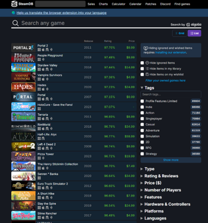
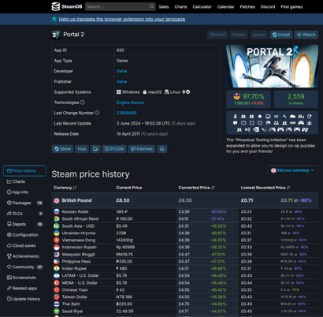

# 24 Hour Player Peak Analysis for Games on SteamDB

- Hasti Karimi
- Fateme Mohammadi
- Ali Lotfollahi

## Introduction

With the video game industry growing day by day, penetrating our lives more and more, we decided to work on analyzing them based on the data on Steam DB website targeting their 24 hour player peak. 24 hour player peak, as the feature to be modeled by other criteria, demonstrates what is the maximum number of players playing a certain game concurrently in each day. It is a metric to assess how much involving a game is in a way people would deliberately spend their valuable time playing it. In this project-assignment, we delve into how data was extracted, modified, and employed so that predictive models could form addressing 24 hour player peak.

## Step 1: Data Collection

The first step was gathering a rich set of data from the selected website <http://steamdb.info>. For this purpose, we conducted three scraping scripts held in following files:

- `webScrape_main.ipynb`
- `webScrape_price.ipynb`
- `webScrape_URL.ipynb`

`webScrape_main.ipynb` is where most work is done. It extracts many features from each game's profile on SteamDB website.

First it extracts all urls associated with each game in Steam DB's search page. It creates a mapping from the name of each game to its corresponding url and stores it in `game_urls.txt`.

Next, `webScrape_main.ipynb` extracts needed data inscribed on each game's profile including:

- NAME
- STORE_GENRE
- RATING_SCORE
- N_SUPPORTED_LANGUAGES
- DEVELOPERS
- SUPPORTED_PLATFORMS
- POSITIVE_REVIEWS
- NEGATIVE_REVIEWS
- TECHNOLOGIES
- RELEASE_DATE
- TOTAL_TWITCH_PEAK
- N_DLC
- 24_HOUR_PEAK

However, this was not the end since price was difficult to be drawn out of this page. Thus, there came the idea of `webScrape_price.ipynb`. This script scrapes prices off of Steam DB's search page. This enabled us to ignore all the complexity of mining price for the correct currency from each game's profile page.

Due to the awkwardness of `webScrape_prices.ipynb`'s results, `webScrape_URL.ipynb` was added to extract prices where other scripts had failed. This shot, sadly, failed, too, when the approaching deadline was observed.

So far, we had accumulated about 3000 entries of games in our tables. Although this number is rather small for such a huge task, we stopped collecting data here due to time deficiencies and the lack of necessary horizontal mining power. Having that said, data was now ready for further transformations.

## Step 2: Preprocessing

After that data were gathered from the Internet, some transformations and cleanings were required to make collected data exploitable. Since our mined data was raw and without any further cleaning, this section took too much time and energy.

For this matter the following steps were taken:

1. Removing duplicate games
2. Removing entries with more than 25 percent missing values.
3. Extracting publish year
4. Removing publish year column's missing values manually
5. Dropping all entries with no developer
6. Converting N_SUPPORTED_LANGUAGES to integer and then cleaning it
7. Replacing RATING_SCORE with the value of positive reviews count over the number of all reviews
8. Cleaning STORE_GENRE column
9. Extracting TWITCH_PEAK_HOUR and TWITCH_PEAK_YEAR and then cleaning them
10. Converting 24_HOUR_PEAK (target feature) to integer
11. Cleaning and One-Hot encoding of TECHNOLOGIES column
12. One-Hot encoding of STORE_GENRE column
13. One-Hot encoding of SUPPORTED_PLATFORMS
14. Merging price data frame with the main one: it could have been a really important phase of this section. However, this was not that delicate anymore due to the lack of price value for many games in the main data frame. We admit that it was a shortage, nonetheless, because the price of a game in this industry does not contain much information about how popular it is, keeping it is not as important as it seems in for this model. The price tag is mostly determined by the category and genre of the game not necessarily its demand.

It must be repeated that most cleaning items listed above were due to the rawness of data and it being thoroughly entangled with text clutter.

At the end this data frame is saved on the directory as `preprocessed_game_info.csv`, while begging to be analyzed.

## Step 3: Analysis

## Step 4: Predictive Models
