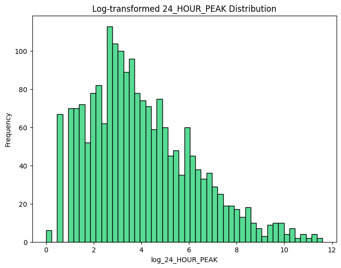

# 24 Hour Player Peak Analysis for Games on SteamDB

- Hasti Karimi
- Fateme Mohammadi
- Ali Lotfollahi

## Table of Content

- [24 Hour Player Peak Analysis for Games on SteamDB](#24-hour-player-peak-analysis-for-games-on-steamdb)
  - [Table of Content](#table-of-content)
  - [Introduction](#introduction)
  - [Step 1: Data Collection](#step-1-data-collection)
  - [Step 2: Preprocessing](#step-2-preprocessing)
  - [Step 3: Analysis](#step-3-analysis)
    - [24\_HOUR\_PEAK](#24_hour_peak)
    - [PRICE](#price)
    - [PUBLISH\_YEAR](#publish_year)
    - [PLATFORM](#platform)
    - [GENRE](#genre)
    - [REVIEWS](#reviews)
    - [DEVELOPERS](#developers)
    - [Final Word](#final-word)
  - [Step 4: Predictive Models](#step-4-predictive-models)

## Introduction

With the video game industry growing day by day, penetrating our lives more and more, we decided to work on analyzing them based on the data on Steam DB website targeting their 24 hour player peak. 24 hour player peak, as the feature to be modeled by other criteria, demonstrates what is the maximum number of players playing a certain game concurrently in each day. It is a metric to assess how much involving a game is in a way people would deliberately spend their valuable time playing it. In this project-assignment, we delve into how data was extracted, modified, and employed so that predictive models could form addressing 24 hour player peak.

## Step 1: Data Collection

The first step was gathering a rich set of data from the selected website <http://steamdb.info>. For this purpose, we conducted three scraping scripts held in following files:

- `webScrape_main.ipynb`
- `webScrape_price.ipynb`
- `webScrape_URL.ipynb`

`webScrape_main.ipynb` is where most work is done. It extracts many features from each game's profile on SteamDB website.

First it extracts all urls associated with each game in Steam DB's search page. It creates a mapping from the name of each game to its corresponding url and stores it in `game_urls.txt`.

Next, `webScrape_main.ipynb` extracts needed data inscribed on each game's profile including:

- NAME
- STORE_GENRE
- RATING_SCORE
- N_SUPPORTED_LANGUAGES
- DEVELOPERS
- SUPPORTED_PLATFORMS
- POSITIVE_REVIEWS
- NEGATIVE_REVIEWS
- TECHNOLOGIES
- RELEASE_DATE
- TOTAL_TWITCH_PEAK
- N_DLC
- 24_HOUR_PEAK

However, this was not the end since price was difficult to be drawn out of this page. Thus, there came the idea of `webScrape_price.ipynb`. This script scrapes prices off of Steam DB's search page. This enabled us to ignore all the complexity of mining price for the correct currency from each game's profile page.

Due to the awkwardness of `webScrape_prices.ipynb`'s results, `webScrape_URL.ipynb` was added to extract prices where other scripts had failed. This shot, sadly, failed, too, when the approaching deadline was observed.

So far, we had accumulated about 3000 entries of games in our tables. Although this number is rather small for such a huge task, we stopped collecting data here due to time deficiencies and the lack of necessary horizontal mining power. Having that said, data was now ready for further transformations.

## Step 2: Preprocessing

After that data were gathered from the Internet, some transformations and cleanings were required to make collected data exploitable. Since our mined data was raw and without any further cleaning, this section took too much time and energy.

For this matter the following steps were taken:

1. Removing duplicate games
2. Removing entries with more than 25 percent missing values.
3. Extracting publish year
4. Removing publish year column's missing values manually
5. Dropping all entries with no developer
6. Converting N_SUPPORTED_LANGUAGES to integer and then cleaning it
7. Replacing RATING_SCORE with the value of positive reviews count over the number of all reviews
8. Cleaning STORE_GENRE column
9. Extracting TWITCH_PEAK_HOUR and TWITCH_PEAK_YEAR and then cleaning them
10. Converting 24_HOUR_PEAK (target feature) to integer
11. Cleaning and One-Hot encoding of TECHNOLOGIES column
12. One-Hot encoding of STORE_GENRE column
13. One-Hot encoding of SUPPORTED_PLATFORMS
14. Merging price data frame with the main one: it could have been a really important phase of this section. However, this was not that delicate anymore due to the lack of price value for many games in the main data frame. We admit that it was a shortage, nonetheless, because the price of a game in this industry does not contain much information about how popular it is, keeping it is not as important as it seems in for this model. The price tag is mostly determined by the category and genre of the game not necessarily its demand.

Two things must be noticed here:

1. Any time a feature or an entity was deleted, it was due to its ineptitude in details. (low number of entries or columns representing it)
2. Also, it must be repeated that most of above tasks listed above were due to the rawness of data and it being thoroughly entangled with text clutter.

At the end this data frame is saved on the directory as `preprocessed_game_info.csv`, while begging to be analyzed.

## Step 3: Analysis

Now that data is finally cleansed, exploration of the data could be underway.

### 24_HOUR_PEAK

Here the correlation heatmap of numerical features is illustrated. As it is seen, 24 hour player peak of games is highly correlated with the total number of positive and negative reviews (since with more reviews comes more people who have played the game), and their Twitch peak in an hour and in a year.
<!-- TODO -->

In this figure we illustrated the correlations with 24 hour player peak explicitly.

With all the histograms plotted here, the distribution of features is illustrated. It could be derived that the distribution of the target column, 24_HOUR_PEAK, is almost logarithmic.

For further clarification, let us take a look at the histogram of 24_HOUR.

It is clear that by transforming 24_HOUR_PEAK to its logarithm, we can obtain more realistic behavior in our models.

After logarithmic transformation of 24_HOUR_PEAK, this would be the distribution of this column. It is much more feasible to being modeled as a normal distribution.

Since our target column has depicted from many aspects, let us look at the PRICE column.

### PRICE

You can see an illustration of price values' distribution. Of course, like any other monetary feature, it has a long logarithmic skewness to the right.

To show how much data is missing comparative to the number of entries, we label prices as follows:

- -1 for free games
- 1 for paid games
- 0 for games with unknown price

The following plot illustrates how many of the games in our data frame does not have any price tag.

This is why PRICE as a column is dropped in the next phase.

### PUBLISH_YEAR

The figure above depicts how games are distributed chronologically. It shows a left-skewness which is logical since this industry is growing day by day at the moment.

However, what is more interesting is the average 24_HOUR_PEAK of games based on their publish year.

This figure shows that there is not any linear or exponential relationship between these two features. It totally depends on the games.

### PLATFORM

Another interesting distribution that did catch our eyes, was the average 24_HOUR_PEAK of games grouped by their platform.

This shows that between games that support Linux OS, they have the most average daily player peak compared to others. Our expectations were totally different since Windows and MacOS are more compatible with most games.

There was also another aspect to the PLATFORM column. We derived a new feature as the number of platforms a game supports. It could be seen that 24_HOUR_PEAK has a direct relationship with the number of supported platforms:

### GENRE

The figure below completely demonstrates that massively multiplayer games have the most fans compared to other genres.

### REVIEWS

For the reviews first the relative number of positive and negative reviews were calculated and different aspects of them are plotted over all the data. The most correlated review-related feature is TOTAL_RATE_SUM, which is the number of all reviews.

Other features related to the number of reviews are shown less correlated with our target so there is no need to talk more about them.

### DEVELOPERS

Since there was many developers and the number of our collected entries was low, we did not elaborate much about developers and most importantly famous ones. However, it could have been clearly a case study. To reason why we chose this path let us say that when our cleaned data was a close to 2500 entries, the number of distinct developers was more than 1600, which clearly eliminates any further analysis on **all** of the developers. But as I said famous ones could have been addressed in the study.

### Final Word

After all this being said, to close our *'exploration'* on the data, let us take a closer look at this plot.

In this plot we addressed the logarithmic behavior of 24_HOUR_PEAK. Plus, it shows the correlation of features with the newly constituted target column. This plot is our entrypoint to the next phase: training predictive models.

## Step 4: Predictive Models
