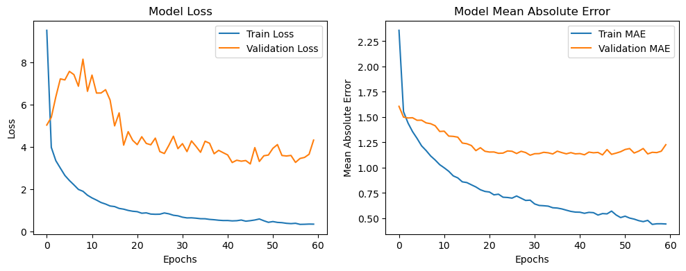

# 24 Hour Player Peak Analysis for Games on SteamDB

- Hasti Karimi
- Fateme Mohammadi
- Ali Lotfollahi

## Table of Content

- [24 Hour Player Peak Analysis for Games on SteamDB](#24-hour-player-peak-analysis-for-games-on-steamdb)
  - [Table of Content](#table-of-content)
  - [Introduction](#introduction)
  - [Step 1: Data Collection](#step-1-data-collection)
  - [Step 2: Preprocessing](#step-2-preprocessing)
  - [Step 3: Analysis](#step-3-analysis)
    - [24\_HOUR\_PEAK](#24_hour_peak)
    - [PRICE](#price)
    - [PUBLISH\_YEAR](#publish_year)
    - [PLATFORM](#platform)
    - [GENRE](#genre)
    - [REVIEWS](#reviews)
    - [DEVELOPERS](#developers)
    - [Final Word](#final-word)
  - [Step 4: Predictive Models](#step-4-predictive-models)
    - [Evaluation Metrics](#evaluation-metrics)
    - [Feature Selection: Using All Features](#feature-selection-using-all-features)
      - [Neural Network 1](#neural-network-1)
      - [Neural Network 2](#neural-network-2)
      - [Neural Network Grid Search](#neural-network-grid-search)
      - [Decision Tree Regressor](#decision-tree-regressor)
      - [Support Vector Machine Regressor (SVR)](#support-vector-machine-regressor-svr)
      - [Linear Regression](#linear-regression)
      - [K Nearest Neighbor Regressor](#k-nearest-neighbor-regressor)
      - [Extreme Gradient Boosting Regressor](#extreme-gradient-boosting-regressor)
    - [Feature Selection: Principal Component Analysis (n\_components = 0.95)](#feature-selection-principal-component-analysis-n_components--095)
      - [Neural Network GridSearch](#neural-network-gridsearch)
      - [Extreme Gradient Boosting Regressor](#extreme-gradient-boosting-regressor-1)
    - [Feature Selection: 10 Top Feature Based on f\_regression](#feature-selection-10-top-feature-based-on-f_regression)
      - [Neural Network Grid Search](#neural-network-grid-search-1)
      - [Extreme Gradient Boosting Regressor](#extreme-gradient-boosting-regressor-2)

## Introduction

With the video game industry growing day by day, penetrating our lives more and more, we decided to work on analyzing them based on the data on Steam DB website targeting their 24 hour player peak. 24 hour player peak, as the feature to be modeled by other criteria, demonstrates what is the maximum number of players playing a certain game concurrently in each day. It is a metric to assess how much involving a game is in a way people would deliberately spend their valuable time playing it. In this project-assignment, we delve into how data was extracted, modified, and employed so that predictive models could form addressing 24 hour player peak.

## Step 1: Data Collection

The first step was gathering a rich set of data from the selected website <http://steamdb.info>. For this purpose, we conducted three scraping scripts held in following files:

- `webScrape_main.ipynb`
- `webScrape_price.ipynb`
- `webScrape_URL.ipynb`

`webScrape_main.ipynb` is where most work is done. It extracts many features from each game's profile on SteamDB website.

First it extracts all urls associated with each game in Steam DB's search page. It creates a mapping from the name of each game to its corresponding url and stores it in `game_urls.txt`.


Next, `webScrape_main.ipynb` extracts needed data inscribed on each game's profile including:

- NAME
- STORE_GENRE
- RATING_SCORE
- N_SUPPORTED_LANGUAGES
- DEVELOPERS
- SUPPORTED_PLATFORMS
- POSITIVE_REVIEWS
- NEGATIVE_REVIEWS
- TECHNOLOGIES
- RELEASE_DATE
- TOTAL_TWITCH_PEAK
- N_DLC
- 24_HOUR_PEAK


However, this was not the end since price was difficult to be drawn out of this page. Thus, there came the idea of `webScrape_price.ipynb`. This script scrapes prices off of Steam DB's search page. This enabled us to ignore all the complexity of mining price for the correct currency from each game's profile page.

Due to the awkwardness of `webScrape_prices.ipynb`'s results, `webScrape_URL.ipynb` was added to extract prices where other scripts had failed. This shot, sadly, failed, too, when the approaching deadline was observed.

So far, we had accumulated about 3000 entries of games in our tables. Although this number is rather small for such a huge task, we stopped collecting data here due to time deficiencies and the lack of necessary horizontal mining power. Having that said, data was now ready for further transformations.

## Step 2: Preprocessing

After that data were gathered from the Internet, some transformations and cleanings were required to make collected data exploitable. Since our mined data was raw and without any further cleaning, this section took too much time and energy.

For this matter the following steps were taken:

1. Removing duplicate games
2. Removing entries with more than 25 percent missing values.
3. Extracting publish year
4. Removing publish year column's missing values manually
5. Dropping all entries with no developer
6. Converting N_SUPPORTED_LANGUAGES to integer and then cleaning it
7. Replacing RATING_SCORE with the value of positive reviews count over the number of all reviews
8. Cleaning STORE_GENRE column
9. Extracting TWITCH_PEAK_HOUR and TWITCH_PEAK_YEAR and then cleaning them
10. Converting 24_HOUR_PEAK (target feature) to integer
11. Cleaning and One-Hot encoding of TECHNOLOGIES column
12. One-Hot encoding of STORE_GENRE column
13. One-Hot encoding of SUPPORTED_PLATFORMS
14. Merging price data frame with the main one: it could have been a really important phase of this section. However, this was not that delicate anymore due to the lack of price value for many games in the main data frame. We admit that it was a shortage, nonetheless, because the price of a game in this industry does not contain much information about how popular it is, keeping it is not as important as it seems in for this model. The price tag is mostly determined by the category and genre of the game not necessarily its demand.

Two things must be noticed here:

1. Any time a feature or an entity was deleted, it was due to its ineptitude in details. (low number of entries or columns representing it)
2. Also, it must be repeated that most of above tasks listed above were due to the rawness of data and it being thoroughly entangled with text clutter.

At the end this data frame is saved on the directory as `preprocessed_game_info.csv`, while begging to be analyzed.

## Step 3: Analysis

Now that data is finally cleansed, exploration of the data could be underway.

### 24_HOUR_PEAK


Here the correlation heatmap of numerical features is illustrated. As it is seen, 24 hour player peak of games is highly correlated with the total number of positive and negative reviews (since with more reviews comes more people who have played the game), and their Twitch peak in an hour and in a year.
<!-- TODO -->


In this figure we illustrated the correlations with 24 hour player peak explicitly.


With all the histograms plotted here, the distribution of features is illustrated. It could be derived that the distribution of the target column, 24_HOUR_PEAK, is almost logarithmic.

For further clarification, let us take a look at the histogram of 24_HOUR.


It is clear that by transforming 24_HOUR_PEAK to its logarithm, we can obtain more realistic behavior in our models.


After logarithmic transformation of 24_HOUR_PEAK, this would be the distribution of this column. It is much more feasible to being modeled as a normal distribution.

Since our target column has depicted from many aspects, let us look at the PRICE column.

### PRICE


You can see an illustration of price values' distribution. Of course, like any other monetary feature, it has a long logarithmic skewness to the right.

To show how much data is missing comparative to the number of entries, we label prices as follows:

- -1 for free games
- 1 for paid games
- 0 for games with unknown price

The following plot illustrates how many of the games in our data frame does not have any price tag.


This is why PRICE as a column is dropped in the next phase.

### PUBLISH_YEAR


The figure above depicts how games are distributed chronologically. It shows a left-skewness which is logical since this industry is growing day by day at the moment.

However, what is more interesting is the average 24_HOUR_PEAK of games based on their publish year.


This figure shows that there is not any linear or exponential relationship between these two features. It totally depends on the games.

### PLATFORM

Another interesting distribution that did catch our eyes, was the average 24_HOUR_PEAK of games grouped by their platform.


This shows that between games that support Linux OS, they have the most average daily player peak compared to others. Our expectations were totally different since Windows and MacOS are more compatible with most games.

There was also another aspect to the PLATFORM column. We derived a new feature as the number of platforms a game supports. It could be seen that 24_HOUR_PEAK has a direct relationship with the number of supported platforms:


### GENRE

The figure below completely demonstrates that massively multiplayer games have the most fans compared to other genres.


### REVIEWS

For the reviews first the relative number of positive and negative reviews were calculated and different aspects of them are plotted over all the data. The most correlated review-related feature is TOTAL_RATE_SUM, which is the number of all reviews.


Other features related to the number of reviews are shown less correlated with our target so there is no need to talk more about them.

### DEVELOPERS

Since there was many developers and the number of our collected entries was low, we did not elaborate much about developers and most importantly famous ones. However, it could have been clearly a case study. To reason why we chose this path let us say that when our cleaned data was a close to 2500 entries, the number of distinct developers was more than 1600, which clearly eliminates any further analysis on **all** of the developers. But as I said famous ones could have been addressed in the study.

### Final Word

After all this being said, to close our *'exploration'* on the data, let us take a closer look at this plot.


In this plot we addressed the logarithmic behavior of 24_HOUR_PEAK. Plus, it shows the correlation of features with the newly constituted target column. This plot is our entrypoint to the next phase: training predictive models.

## Step 4: Predictive Models

Before training our models, two things were to be decided:

1. removing highly correlated features with others: TOTAL_RATE_SUM
2. strategies overtaken for selecting features.
3. evaluation metrics

The first one was simple.

For the second issue, there were three different approach taken by us for feature selection, which will be addressed at shortly.

But for the third one, we must specify a section for its importance.

### Evaluation Metrics

The evaluation metrics chosen by us were not surprisingly regression-related metrics. It means that because the nature of our target feature was continuous, the type of estimators we used should have been regressors. Therefore, the metrics we could have used must have been loss functions and their combinations.

For this project for keeping things simple, the following metrics were chosen to be involved in the training and assessment of our models:

- $R^2$ score
- Mean square error

Also, just for the sake of display, the Mean Absolute Error was used, too.

### Feature Selection: Using All Features

Next, it was given to a similar NN and the following results were accomplished:

#### Neural Network 1

```python
model = Sequential([
    Input(shape=(X_train_scaled.shape[1],)),
    Dense(32, activation='relu'),
    Dense(64, activation='relu'),
    Dense(32, activation='relu'),
    Dense(1, activation='relu')
])
```



| | Set | Loss | RMSE | R-squared | MAE |
| - | - | - | - | - | - |
| 0   | Training   | 1.217586 | 1.052511 | 0.770634 | 0.615379 |
| 1   | Validation | 2.183037 | 1.482897 | 0.531131 | 1.176697 |

#### Neural Network 2

For a more complex NN with the description below, the results would be the following:

```python
model = Sequential([
    Input(shape=(X_train_scaled.shape[1],)),
    Dense(32, activation='relu', kernel_regularizer=l2(0.01)),
    BatchNormalization(),
    Dropout(0.2),
    Dense(64, activation='relu', kernel_regularizer=l2(0.01)),
    BatchNormalization(),
    Dropout(0.2),
    Dense(32, activation='relu', kernel_regularizer=l2(0.01)),
    BatchNormalization(),
    Dropout(0.2),
    Dense(1)  # Linear activation for regression
])
```


| | Set | Loss | RMSE | R-squared | MAE |
| - | - | - | - | - | - |
| 0 | Training | 1.969014 | 1.162526 | 0.720179 | 0.849738 |
| 1 | Validation | 2.392664 | 1.351710 | 0.610420 | 1.034928 |

By looking at both tables so far, it would be clear that the second neural network is improving $R^2$ score by 0.1, which is the main criterion for us in model comparison.

#### Neural Network Grid Search

After struggling for coming up with a good NN, we decided to work on a grid search (not the library) for determining which neural network configuration would be the best:

The result was stored in the following table:

|     | # of units per layer | # of epochs | Size of batches | Training time | Loss (Train) | Loss (TEST) | RMSE (Train) | RMSE (TEST) | R2 (Train) | R2 (TEST) | MAE (Train) | MAE (TEST) |
| --- | -------------------- | ----------- | --------------- | ------------- | ------------ | ----------- | ------------ | ----------- | ---------- | --------- | ----------- | ---------- |
| 0   | 16  | 32  | 64  | 3.741940  | 2.549694 | 3.018758 | 1.596776 | 1.737457 | 0.472086 | 0.356338 | 1.061174 | 1.258086 |
| 1   | 256 | 200 | 16  | 28.986325 | 0.554259 | 1.680379 | 0.744485 | 1.296294 | 0.885241 | 0.641708 | 0.460525 | 1.034333 |
| 2   | 16  | 200 | 16  | 26.987884 | 0.658522 | 1.493838 | 0.811493 | 1.222227 | 0.863653 | 0.681483 | 0.579325 | 0.962577 |
| 3   | 16  | 128 | 16  | 16.896468 | 0.908914 | 1.555800 | 0.953370 | 1.247317 | 0.811809 | 0.668271 | 0.630648 | 0.951122 |

Based on this table, this NN would perform best after 200 epochs with batch sizes of 16:

```python
model = Sequential([
    Input(shape=(X_train_scaled.shape[1],)),
    Dense(128, activation='relu'),
    Dropout(rate=0.4),
    Dense(16, activation='relu'),
    Dense(1, activation='relu')
])
```

Up until this point, 0.68 $R^2$ score was our best trained model so far.

#### Decision Tree Regressor

After tackling with neural network instances, it was Decision Tree Regressor's turn. We trained various models using the parameter grid below to find the best hyper parameters:

```python
param_grid = {
    'max_depth': [None, 10, 20, 30, 40, 50],
    'min_samples_split': [2, 5, 10, 20],
    'min_samples_leaf': [1, 2, 4, 10]
}
```

For acquiring a testing insight on our models, here along with the future, we used Cross-Fold Validation method to test trained models.

Best obtained hyper parameters based on RMSE as the loss function were:

```text
Best parameters found:  {'max_depth': 10, 'min_samples_leaf': 10, 'min_samples_split': 10}
```


This figure shows how much the size of the training data has effects on the best performing model.

This model's performance on train and test data is as follows:

```text
Decision Tree:
Mean Absolute Error (MAE): 0.6147685820377253
Root Mean Squared Error (RMSE): 0.7949319740380001
R-squared: 0.8691616072733632
********************************************************************************
Decision Tree (TEST):
Mean Absolute Error (MAE): 0.8455609439947211
Root Mean Squared Error (RMSE): 1.1141953095109933
R-squared: 0.735301000398328
```

We assume the reason that NN models failed in outputting these $R^2$ scores, was the lack of data entries. If we had twice or three times more data, neural networks would have fitted the complexity and the variance of our data in more details than any decision tree regressor would.

#### Support Vector Machine Regressor (SVR)

The very steps taken with decision trees, were also taken for some other regressors by us. One of those regressors was SVR.

```python
param_grid = {
    'kernel': ['linear', 'poly', 'sigmoid'],
    'C': [0.001, 0.01, 0.05, 0.1, 0.5, 0.9, 1],
    'epsilon': [0.01, 0.015, 0.02, 0.05, 0.1, 1]
}
```

As it is clarified in above hyper-parameter grid, our grid search was held to find the best HPs using this map. The result was:

```text
Best parameters found:  {'C': 0.05, 'epsilon': 0.02, 'kernel': 'sigmoid'}
```


As there was the same plot for the decision tree regressor, this figure shows how much our scores are affected by the size of the train data. When compared to the latter model, the decision tree regressor, this model shows more dependency to the number of train data it receives.

The results for the best performing SVR is as follows:

```text
Support Vector Machine:
Mean Absolute Error (MAE): 1.3956271070033301
Root Mean Squared Error (RMSE): 1.744185869877018
R-squared: 0.37011568096456693
********************************************************************************
Support Vector Machine (TEST):
Mean Absolute Error (MAE): 1.424771084435031
Root Mean Squared Error (RMSE): 1.766725135936086
R-squared: 0.33447001946996047
```

Apparently, based on the numbers above, one could eliminate SVR from its estimators. The reason for that is clearly weaker representations obtained by these models compared to the ones with decision trees.

#### Linear Regression

Again, the same steps are followed and the same kinds of results were attained.

Hyper-parameter grid:

```python
param_grid = {
    'fit_intercept': [True, False],
    'copy_X': [True, False]
}
```

Best parameters found:

```text
Best parameters found:  {'copy_X': True, 'fit_intercept': True}
```

The relationship between train sizes and scores:


The best performing model:

```text
Linear Regression (Training):
Mean Absolute Error (MAE): 1.3431794781023956
Root Mean Squared Error (RMSE): 1.681415033516217
R-squared: 0.41463719745009053
********************************************************************************
Linear Regression (TEST):
Mean Absolute Error (MAE): 1.3606837568204557
Root Mean Squared Error (RMSE): 1.6960694969679437
R-squared: 0.3866379023522314
```

Again, as it is demonstrated above it is observed that the relationship between input features and the output is not linear at all.

#### K Nearest Neighbor Regressor

Hyper-parameter grid:

```python
param_grid = {
    'n_neighbors': [3, 5, 7, 9, 11],
    'p': [1, 2]  # 1 for Manhattan distance, 2 for Euclidean distance
}
```

Best parameters found:

```text
Best parameters found:  {'n_neighbors': 7, 'p': 1}
```

The relationship between train sizes and scores:


The best performing model:

```text
KNN (Training):
Mean Absolute Error (MAE): 1.1198805226699178
Root Mean Squared Error (RMSE): 1.4586889559884466
R-squared: 0.5594444682492764
********************************************************************************
KNN (TEST):
Mean Absolute Error (MAE): 1.3721145616269976
Root Mean Squared Error (RMSE): 1.753059870304279
R-squared: 0.3447256853450662
```

It can be perceived that KNN performs better on the train data and it fits it more accurately. Nevertheless, the test scores are not good at all.

#### Extreme Gradient Boosting Regressor

For a really good model on the train data we finally decided to use the XG Boosting Regressor. It is a really powerful model that exploits decision trees and gradient descent.

It's descriptor is:

```python
xg_reg = xgb.XGBRegressor(objective ='reg:squarederror', colsample_bytree = 0.3, learning_rate = 0.01, max_depth = 5, alpha = 10, n_estimators = 1000)
```


Scoring on train and test data:

```text
XGBoost (Training):
Mean Absolute Error (MAE): 0.5860730929603588
Root Mean Squared Error (RMSE): 0.7496485854850025
R-squared: 0.8836434808238242
********************************************************************************
XGBoost (TEST):
Mean Absolute Error (MAE): 0.7428412842719543
Root Mean Squared Error (RMSE): 0.9654529669740577
R-squared: 0.8012569770531637
```

This model is extremely powerful and it can match accuracy of NNs on any data. It gives us 0.80 $R^2$ score on the test data, which is way more than any other model. So this would be our chosen model so far.

### Feature Selection: Principal Component Analysis (n_components = 0.95)

For this strategy, first we test some thing. We show that reducing the number of components can at most preserve 81.33% of the variance.

Then, data is transformed with 95% preservation on variance.

After this short unrelated illustration, let us delve into fitting models on the PCAed input matrix.

#### Neural Network GridSearch

|     | # of units per layer | # of epochs | Size of batches | Training time | Loss (Train) | Loss (TEST) | RMSE (Train) | RMSE (TEST) | R2 (Train) | R2 (TEST) | MAE (Train) | MAE (TEST) |
| :-- | :------------------- | :---------- | :-------------- | :------------ | :----------- | :---------- | :----------- | :---------- | :--------- | :-------- | :---------- | :--------- |
| 0   | 16                   | 32          | 64              | 3.643546      | 3.110680     | 3.509193    | 1.763712     | 1.873284    | 0.355934   | 0.251767  | 1.144121    | 1.350002   |
| 1   | 256                  | 200         | 16              | 29.174867     | 0.875590     | 1.856288    | 0.935730     | 1.362456    | 0.818709   | 0.604201  | 0.524072    | 1.083147   |
| 2   | 16                   | 200         | 16              | 26.729690     | 0.940843     | 1.778513    | 0.969970     | 1.333609    | 0.805199   | 0.620784  | 0.660116    | 1.047676   |
| 3   | 16                   | 128         | 16              | 17.475826     | 0.935510     | 1.936591    | 0.967218     | 1.391615    | 0.806303   | 0.587078  | 0.712915    | 1.013782   |

Since the best $R^2$ score in this table for test data is 0.62, the best NN obtained would be described with code below:

```python
model = Sequential([
        Input(shape=(X_train_pca_95.shape[1],)),
        Dense(128, activation='relu'),
        Dropout(rate=0.4),
        Dense(16, activation='relu'),
        Dense(1, activation='relu')
    ])
```

In this model the size of batches that the input data is given to the NN is 16 and this training was gone for 200 epochs.

#### Extreme Gradient Boosting Regressor

As the best performing model in the previous section, a XG Boosting Regressor was fit on the PCAed data. As it was expected this model performed weaker than the other XG Boosting Regressor trained in the previous section.

The scores achieved by this model is shown below:

```text
XGBoost (Training):
Mean Absolute Error (MAE): 0.8277082735326102
Root Mean Squared Error (RMSE): 1.0373939837236694
R-squared: 0.7771756136897428
********************************************************************************
XGBoost (TEST):
Mean Absolute Error (MAE): 1.300783071858265
Root Mean Squared Error (RMSE): 1.634452765069035
R-squared: 0.4303942081830755
```

Even though this model is representing train data good enough with $R^2$ score of 0.77, it does not perform as well on test data.


### Feature Selection: 10 Top Feature Based on f_regression

First approach was selecting 10 top features based on f_regression. In this way, these columns are selected:

- POSITIVE_REVIEWS
- NEGATIVE_REVIEWS
- PUBLISH_YEAR
- RATING_SCORE
- TWITCH_PEAK_HOUR
- GENRECasual
- GENREIndie
- GENRESimulation
- GENREStrategy
- NEGATIVE_REVIEWS_percentage

Having chosen the columns, we use them to model our data.

#### Neural Network Grid Search

The same as the previous way of feature selection (PCA), we run a grid search on a template of neural networks and the result would be the following table (again similar to the previous tables):

|     | # of units per layer | # of epochs | Size of batches | Training time | Loss (Train) | Loss (TEST) | RMSE (Train) | RMSE (TEST) | R2 (Train) | R2 (TEST) | MAE (Train) | MAE (TEST) |
| :-- | :------------------- | :---------- | :-------------- | :------------ | :----------- | :---------- | :----------- | :---------- | :--------- | :-------- | :---------- | ---------- |
| 0   | 16                   | 32          | 64              | 3.692096      | 2.335184     | 2.174313    | 1.528131     | 1.474555    | 0.516500   | 0.536391  | 1.034369    | 1.135857   |
| 1   | 256                  | 200         | 16              | 31.320140     | 0.820414     | 1.387802    | 0.905767     | 1.178050    | 0.830133   | 0.704092  | 0.707147    | 0.919961   |
| 2   | 16                   | 200         | 16              | 27.973862     | 0.933618     | 1.391563    | 0.966239     | 1.179645    | 0.806694   | 0.703290  | 0.751252    | 0.915005   |
| 3   | 16                   | 128         | 16              | 20.420817     | 1.143844     | 1.413223    | 1.069506     | 1.188791    | 0.763167   | 0.698671  | 0.770759    | 0.929294   |

Based on this data, the best hyper parameters for this template is as follows:

- size of batches: 16
- number of epochs: 200

And these parameters must apply on the following NN:

```python
model = Sequential([
    Input(shape=(X_train_selected_scaled.shape[1],)),
    Dense(128, activation='relu'),
    Dropout(rate=0.4),
    Dense(256, activation='relu'),
    Dense(1, activation='relu')
])
```

This model would output an $R^2$ score of 0.704 on test data. Which is actually one the best models we had so far.

#### Extreme Gradient Boosting Regressor

Again as the icing on the cake we point at an XG Boosting Regressor. The model descriptor would be as follows:

```python
xg_reg = xgb.XGBRegressor(objective ='reg:squarederror', colsample_bytree = 0.3, learning_rate = 0.01, max_depth = 5, alpha = 10, n_estimators = 1000)
```

This model would result in following scores for the train and the test data:

```text
XGBoost (Training):
Mean Absolute Error (MAE): 0.6627285206542181
Root Mean Squared Error (RMSE): 0.8482878593363223
R-squared: 0.8510084041377163
********************************************************************************
XGBoost (TEST):
Mean Absolute Error (MAE): 0.809165829148597
Root Mean Squared Error (RMSE): 1.042862691280758
R-squared: 0.7681089913162328
```

Also the convergence of the Training Score and the Cross-Validation Score can be illustrated in the following figure:

